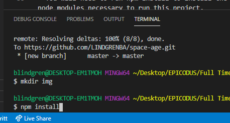

# Space Age

#### A test driven development and behavior driven development project for Epicodus, 06.26.2020

## By Brittany Lindgren

## Description

Now you can find out how old you would be if you lived on Mars, Jupiter or Mercury! Use this nifty application to calculate your age on other planets.

## Setup/Installation Requirements

| Steps | Example |
| -------- | ----- |
| Follow this [link to the project repository](https://github.com/LINDGRENBA/space-age) on GitHub.   |  [Link to the project repository](https://github.com/LINDGRENBA/space-age)  |    
| Click on the "Clone or download" button to copy the project link.   |      |   
| If you are comfortable with the command line, you can copy the project link and clone it through your command line with the command `git clone`. Otherwise, I recommend choosing "**Download ZIP**".   |     |   
|  Once the ZIP file has finished downloading, you can right click on the file to view the zip folder in your downloads.   |     |   
| Right click on the project ZIP folder that you have just downloaded and choose the option "**Copy To...**", then choose the location where you would like to save this folder.    |     |   
| Navigate to the final location where you have chosen to save the project folder.   |    |   
| To view the code itself, right click, choose "open with..." and open using a text editor such as VS Code or Atom, etc.   |     |
|  Once you have cloned or downloaded the project and opened it in VS Code or another text editor, open a new terminal by navigating to Terminal -> New Terminal. A terminal will open on the page.  |   |
| In the terminal type the command `npm install` to install node modules. You should see a file called node_modules appear  |    |
| You can now view the project in your browser by typing the command `npm run start` in the terminal  | `npm run start` |

## Setup/Installation of Node.js and npm

| Steps | Example |
| -------- | ----- |

#### Additional Setup/Installation Notes:

* You will need to run npm install to install the node modules necessary to run this project. 

* Run a server to view this document using npm start.  

## Specifications

| Behavior | Input | Output |  Completed(Y/N?)  | 
| -------- | ----- | ------ | -------- |
|  Program will create a user object that holds user name and age  |  n/a  |  user {name: 'Cheryl', age: '33'}  |  Y  |
|  Program will take user's age and return user age in Mercury years  |  33  |  139.8 |  N  |
|  Program will take user's age and return user age in Venus years  |  33  |  54.7  |  N  |
|  Program will take user's age and return user age in Mars years  |  33  |  17.9  |  N  |
|  Program will take user's age and return user age in Jupiter years  |  33  |  2.84  |  N  |
|  Program will calculate user's average life expectancy on each planet  |  life expectency on Earth = 85   |  life expectancy on Mercury = 351.6 years  |  N  |
|  Program will return the number of years user has lived past their life expectancy if they have surpassed the average life expectancy for their demographic  |  life expectancy = 85, user age = 90  |  5  |  N  |

## Known Bugs

| Location (html/css/js & specific location if known) |  Message  | Bug | Resolved (Y/N) |  How was the issue resolved?  |
| ------- | ----- | ------ | ------ | --------- |
|  |  |  |  |  |

## Support and contact details

Please feel free to contact me through GitHub (username: LINDGRENBA) with any questions, ideas or concerns.  

## Technologies Used

* HTML5
* CSS3
* Bootstrap v-4.5.0
* JavaScript
* jQuery v-3.5.0
* Visual Studio Code 
* Git and Git BASH 
* Node.js
* npm package manager
* Webpack

### License

*This site is licensed under the MIT license.*

Copyright (c) 2020 **Brittany A Lindgren_**